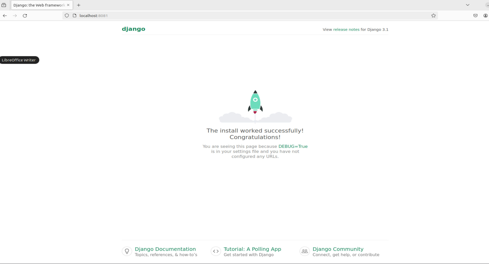
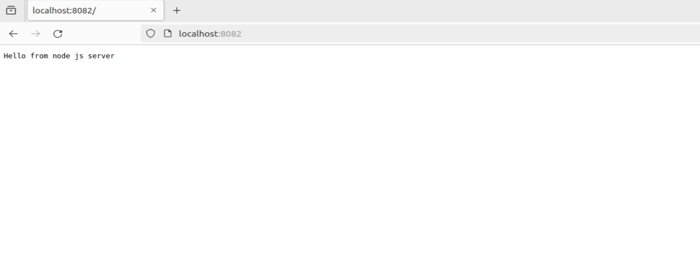
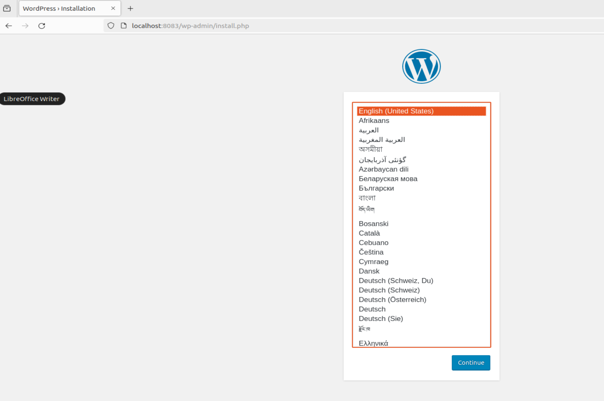

# Цель домашнего задания
Получить практические навыки в настройке инфраструктуры с помощью манифестов и конфигураций. Отточить навыки использования ansible/vagrant/docker.

<pre>
Варианты стенда:
nginx + php-fpm (laravel/wordpress) + python (flask/django) + js(react/angular);
nginx + java (tomcat/jetty/netty) + go + ruby;
можно свои комбинации.
Реализации на выбор:
на хостовой системе через конфиги в /etc;
деплой через docker-compose.
Для усложнения можно попросить проекты у коллег с курсов по разработке
К сдаче принимается:
vagrant стэнд с проброшенными на локалхост портами
каждый порт на свой сайт
через нжинкс Формат сдачи ДЗ - vagrant + ansible

</pre>

# Введение
<pre>
За последние десятилетия, средняя скорость разработки увеличивается с большой прогрессией от года к году, потому что IT продукты приносят огромные деньги бизнесу практически в любой сфере. Высокая интенсивность породила большое количество методологий, ускоряющих разработку. Также выросли требования к инфраструктуре. Появилась необходимость динамически обновлять, откатывать, масштабировать и резервировать нашу инфраструктуру. В нынешних реалиях, одной из ключевых методологий в построении информационных систем, является - Infrastructure as Code ( Инфраструктура как код, IaC ). Она подразумевает подход для управления и описания инфраструктуры ЦОД через конфигурационные файлы, а не через ручное редактирование конфигураций на серверах или интерактивное взаимодействие. Этот подход может включать в себя как декларативный способ описания инфраструктуры, так и через скрипты.  

IaC несёт в себе следующие плюсы:
	- Скорость и уменьшение затрат
	- Масштабируемость и стандартизация
	- Безопасность и документация
	- Восстановление в аварийных ситуациях
</pre>

# Решение:

Данный Vagrantfile развернёт 1 виртаульную машину ОС ubuntu/focal64 с развертыванием стенда nginx + php-fpm (wordpress) + python (django) + js(node.js) с деплоем через docker-compose.

## Конфигурирование выполнено, развернём стенды:

<pre>

sabo@sabo-virtual-machine:~/LESSONS/WEB$ vagrant up
Bringing machine 'DynamicWeb' up with 'virtualbox' provider...
==> DynamicWeb: Importing base box 'ubuntu/focal64'...
==> DynamicWeb: Matching MAC address for NAT networking...
==> DynamicWeb: Checking if box 'ubuntu/focal64' version '20240229.0.0' is up to date...
==> DynamicWeb: Setting the name of the VM: WEB_DynamicWeb_1714197583006_33496
==> DynamicWeb: Clearing any previously set network interfaces...
==> DynamicWeb: Preparing network interfaces based on configuration...
    DynamicWeb: Adapter 1: nat
==> DynamicWeb: Forwarding ports...
    DynamicWeb: 8083 (guest) => 8083 (host) (adapter 1)
    DynamicWeb: 8081 (guest) => 8081 (host) (adapter 1)
    DynamicWeb: 8082 (guest) => 8082 (host) (adapter 1)
    DynamicWeb: 22 (guest) => 2222 (host) (adapter 1)
==> DynamicWeb: Running 'pre-boot' VM customizations...
==> DynamicWeb: Booting VM...
==> DynamicWeb: Waiting for machine to boot. This may take a few minutes...
    DynamicWeb: SSH address: 127.0.0.1:2222
    DynamicWeb: SSH username: vagrant
    DynamicWeb: SSH auth method: private key
    DynamicWeb: 
    DynamicWeb: Vagrant insecure key detected. Vagrant will automatically replace
    DynamicWeb: this with a newly generated keypair for better security.
    DynamicWeb: 
    DynamicWeb: Inserting generated public key within guest...
    DynamicWeb: Removing insecure key from the guest if it's present...
    DynamicWeb: Key inserted! Disconnecting and reconnecting using new SSH key...
==> DynamicWeb: Machine booted and ready!
==> DynamicWeb: Checking for guest additions in VM...
    DynamicWeb: The guest additions on this VM do not match the installed version of
    DynamicWeb: VirtualBox! In most cases this is fine, but in rare cases it can
    DynamicWeb: prevent things such as shared folders from working properly. If you see
    DynamicWeb: shared folder errors, please make sure the guest additions within the
    DynamicWeb: virtual machine match the version of VirtualBox you have installed on
    DynamicWeb: your host and reload your VM.
    DynamicWeb: 
    DynamicWeb: Guest Additions Version: 6.1.50
    DynamicWeb: VirtualBox Version: 7.0
==> DynamicWeb: Setting hostname...
==> DynamicWeb: Mounting shared folders...
    DynamicWeb: /vagrant => /home/sabo/LESSONS/WEB
==> DynamicWeb: Running provisioner: ansible...
    DynamicWeb: Running ansible-playbook...

PLAY [Deploy web app] **********************************************************

TASK [Install docker packages] *************************************************
changed: [DynamicWeb]

TASK [Add Docker s official GPG key] *******************************************
changed: [DynamicWeb]

TASK [Verify that we have the key with the fingerprint] ************************
ok: [DynamicWeb]

TASK [Set up the stable repository] ********************************************
changed: [DynamicWeb]

TASK [Update apt packages] *****************************************************
changed: [DynamicWeb]

TASK [Install docker] **********************************************************
changed: [DynamicWeb]

TASK [Add remote "vagrant" user to "docker" group] *****************************
changed: [DynamicWeb]

TASK [Install docker-compose] **************************************************
changed: [DynamicWeb]

TASK [Copy project] ************************************************************
changed: [DynamicWeb]

TASK [Run container] ***********************************************************
changed: [DynamicWeb]

PLAY RECAP *********************************************************************
DynamicWeb                 : ok=10   changed=9    unreachable=0    failed=0    skipped=0    rescued=0    ignored=0   

sabo@sabo-virtual-machine:~/LESSONS/WEB$ 

</pre>

## 2) Проверка:

http://localhost:8081/

http://localhost:8082/ 

http://localhost:8083/

